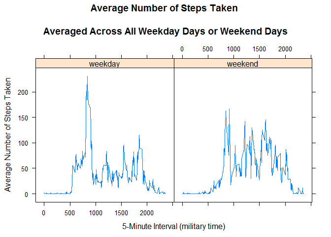

# Reproducible Research: Peer Assessment 1
Juan Pablo Botero  

##Synopsis
The purpose of this project was to practice:

* loading and preprocessing data
* imputing missing values
* interpreting data to answer research questions

## Data
The data for this assignment was downloaded from the course web
site:

* Dataset: [Activity monitoring data](https://d396qusza40orc.cloudfront.net/repdata%2Fdata%2Factivity.zip) [52K]

The variables included in this dataset are:

* **steps**: Number of steps taking in a 5-minute interval (missing
    values are coded as `NA`)

* **date**: The date on which the measurement was taken in YYYY-MM-DD
    format

* **interval**: Identifier for the 5-minute interval in which
    measurement was taken

The dataset is stored in a comma-separated-value (CSV) file and there are a total of 17,568 observations in this dataset.

## Loading and preprocessing the data

Unzip dataset for proccessing activivity.csv

```r
data <- read.table(unz("activity.zip", "activity.csv"), header=T, quote="\"", sep=",")

data$date <- as.Date(data$date)
```

## What is mean total number of steps taken per day?

Total number of steps taken per day


```r
steps_by_day <- aggregate(steps ~ date, data, sum)
```

Plot histogram steps by day

 

Calculate and report the mean and median of the total number of steps taken per day


```r
rmean <- mean(steps_by_day$steps) 
rmedian <- median(steps_by_day$steps)
```

The `mean` is 1.0766189\times 10^{4} and the `median` is 10765.

## What is the average daily activity pattern?

* Calculate average steps for each interval for all days. 
 

```r
steps_by_interval <- aggregate(steps ~ interval, data, mean)
```


* Plot the Average Number Steps per Day by Interval.
 

* Find interval with most average steps.


The 5-minute interval, on average across all the days in the data set, containing the maximum number of steps is 835.


## Imputing missing values

Calculate and report the total number of missing values in the dataset (i.e. the total number of rows with NAs)


```r
library(sqldf)

num_NAs <- sqldf(' 
    SELECT d.*            
    FROM "data" as d
    WHERE d.steps IS NULL 
    ORDER BY d.date, d.interval ')

rwna<-NROW(num_NAs)
```

The number of NA steps is 2304

For this assignment the strategy is to use the mean for that 5-minute interval to replace missing values.
Create a new dataset (t1) that is equal to the original dataset but with the missing data filled in. 
The dataset is ordered by date and interval. The following SQL statement combines the original "data" dataset set and the "steps_by_interval" dataset that contains mean values of each 5-min interval ageraged across all days


```r
t1 <- sqldf('  
    SELECT d.*, i.steps as means
    FROM "steps_by_interval" as i
    JOIN "data" as d
    ON d.interval = i.interval 
    ORDER BY d.date, d.interval ') 

t1$steps[is.na(t1$steps)] <- t1$mean[is.na(t1$steps)]
```

Make a histogram of the total number of steps taken each day

 

Calculate new mean and median for imputed data


```r
rmean.i <- mean(steps_by_day_i$steps) 
rmedian.i <- median(steps_by_day_i$steps) 
```

Calculate difference between imputed and non-imputed data

```r
mean_diff <- rmean.i - rmean 
med_diff <- rmedian.i - rmedian 
```

Calculate total difference of steps


```r
total_diff <- sum(steps_by_day_i$steps) - sum(steps_by_day$steps) 
```

* The imputed data mean is 1.0766189\times 10^{4}
* The imputed data median is 1.0766189\times 10^{4}
* The difference between the non-imputed mean and imputed mean is 0
* The difference between the non-imputed median and imputed median is 1.1886792
* The difference between total number of steps between imputed and non-imputed data is 8.6129509\times 10^{4}. Thus, there were 8.6129509\times 10^{4} more steps in the imputed data.

**Observations:**

-Do these values (mean and median) differ from the estimates from the first part of the assignment? Not Really.

-What is the impact of imputing missing data on the estimates of the total daily number of steps? The shape of the histogram remains the same as the histogram from removed missing values. However, the frequency counts increased as expected. In this case, it seems that the data imputation strategy should work for the downstream data analysis and modeling.

## Are there differences in activity patterns between weekdays and weekends?

Create a factor variable weektime with two levels (weekday, weekend). The folowing dataset t2 dataset contains data: average number of steps taken averaged across all weekday days and weekend days, 5-min intervals, and a facter variable weektime with two levels (weekday, weekend).


```r
t1$weektime <- as.factor(ifelse(weekdays(as.Date(t1$date)) %in%  c("sabado","domingo"),"weekend", "weekday"))

t2 <- sqldf('   
    SELECT interval, avg(steps) as "mean.steps", weektime
    FROM t1
    GROUP BY weektime, interval
    ORDER BY interval ')
```

Make a panel plot containing a time series plot (i.e. type = "l") of the 5-minute interval (x-axis) and the average number of steps taken, averaged across all weekday days or weekend days (y-axis).

 

**Observation:** There is a higher peak earlier on weekdays, and more overall activity on weekends.
